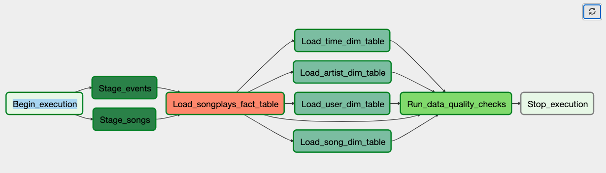
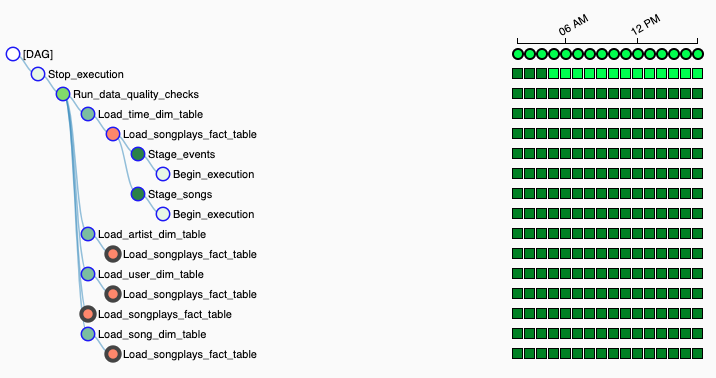

[]
# Data Pipelines with Airflow

## Introduction
Automating the ETL pipeline for Sparkify music data, technology used are: Python, S3, Airflow, Redshift.

## Overview
Automate process flow of data ingestion from various sources in S3 to Redshift. Creating custom operators in Airflow to create facts and dimensions tables, create staging table and complete process to ingest data.

## DAG
[]

### Operators
[]
- Staging Opeartor: Data is copied from S3 using this airlfow operator by PostgreSQL and stored in Redshift fact table.
- Load Fact & Dimension Operators: these operators load teh data in fact and dimensios tables in Redshift
- Data quality Operator: Data checks are in palced in this operator.

## Airflow
Airflow DAG is configured to run daily, weekly or monthly.

## To Run DAG
To run DAG provide  IAM and others redentials and run this command /opt/airflow/start.sh

